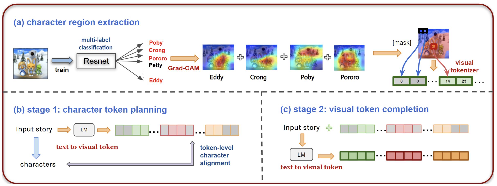

# Character-Centric Story Visualization via Visual Planning and Token Alignment
 

## Overview

## Processing
- Traning VQ-GAN

borrow codes from https://github.com/CompVis/taming-transformers

cd VQ-VAE/taming-transformers

configure train/test image and names in custon_vqgan.yaml

python main.py --base configs/custom_vqgan.yaml -t True --gpus 0,1,2,3

- Training DALLE (VQ-VAQ-LM)

Data could be found here

https://drive.google.com/file/d/10tU8A84XRJ1jLFRyzo1liKFI1f0kwjXB/view?usp=share_link

cd VQ-VAE/VQ-VAE-LM

change train.py line 28-29:

model_path = $VQ_GAN_MODEL_PATH 

model_config = $VQ_GAN_CONFIG_PATH 

python train.py

- Training DALLE (VP-CSV)
Code and data could be found here https://drive.google.com/file/d/1VV6ej_vm-NA6x2uDrYveYOXNLgI_M7vZ/view?usp=sharing

